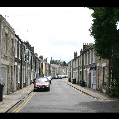

# semantic_segDeepLabv3
## Semantic segmentation with DeepLabv3

Paper: [Rethinking Atrous Convolution for Semantic Image Segmentation](https://arxiv.org/abs/1706.0558)

As a part of the [torchvision](https://pytorch.org/docs/stable/torchvision/models.html#semantic-segmentation), [Fully Convolutional Network ( FCN )](https://people.eecs.berkeley.edu/~jonlong/long_shelhamer_fcn.pdf) and [DeepLab v3: Rethinking Atrous Convolution for Semantic Image Segmentation ](https://arxiv.org/pdf/1706.05587.pdf)have been trained on a subset of COCO Train 2017 dataset which correspond to the PASCAL VOC dataset. There are total 20 categories supported by the models.

I constructed a DeepLabV3 model with a ResNet-101 backbone. If model is pretrained then auxiliary_loss that the Inception models used to increase the gradient signal during the training as explained in [Going Deeper with Convolutions](https://arxiv.org/abs/1409.4842) is also enabled.

The detailed review can be found here [Review: DeepLabv3](https://towardsdatascience.com/review-deeplabv3-atrous-convolution-semantic-segmentation-6d818bfd1d74)
## Dataset: 

MSRC-v2 Segmentation Dataset which includes 23 object classes.

## Sample Outputs

Test accuracy with just 10 epocs is 0.9068867952770199
